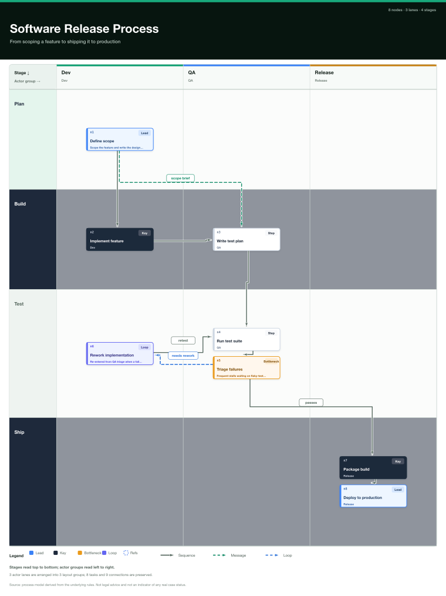
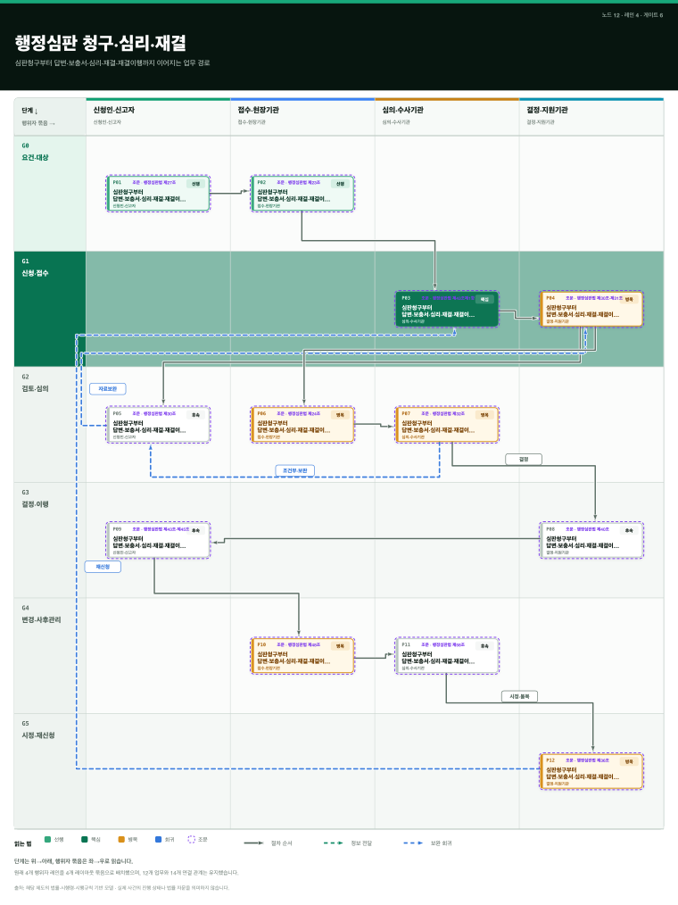

# korea100studio

Turn any process — actors × stages × steps — into a **vertical swimlane board**
(SVG, optional PNG), **audit its composition quality**, and render a
**stage-ordered reveal animation**. korea100studio is a standalone Agent Skill
extracted and generalized from
[korea100](https://hosungseo.github.io/korea100)'s process renderer. It works
inside **Claude Code** and **Codex** via a `SKILL.md` entry point plus a small
zero-native-dependency ESM CLI (`scripts/board.mjs`).

## Examples

Same engine, two profiles — a neutral software-release board (`default`) and a
korea100-style government board (`gov`):

| `default` profile | `gov` profile |
|---|---|
|  |  |

Boards also export a stage-ordered reveal animation (self-contained SMIL SVG) —
see [`assets/example-motion.svg`](assets/example-motion.svg), generated with
`node scripts/board.mjs motion fixtures/generic-sample.json`.

## Install

Clone into your agent's skills directory:

```bash
# Claude Code
git clone https://github.com/hosungseo/korea100studio.git ~/.claude/skills/korea100studio

# Codex
git clone https://github.com/hosungseo/korea100studio.git ~/.agents/skills/korea100studio
```

Then:

```bash
cd ~/.claude/skills/korea100studio   # or wherever you cloned it
npm install
npm test
```

## Quickstart

```bash
# Render a board to SVG (and PNG if rsvg-convert or cairosvg is installed)
node scripts/board.mjs render fixtures/generic-sample.json --out board.svg --png

# Audit composition quality (crossings, node-piercings, bends, route stretch)
node scripts/board.mjs audit fixtures/generic-sample.json

# Gate on quality budget (exit 1 under --strict if over budget)
node scripts/board.mjs validate fixtures/generic-sample.json --strict

# Stage-ordered reveal animation (self-contained animated SVG)
node scripts/board.mjs motion fixtures/generic-sample.json --out board.motion.svg
```

## CLI

| Command | Purpose |
|---|---|
| `render <board.json> [--out f.svg] [--png] [--profile p]` | Render board to SVG; PNG if a rasterizer is present |
| `audit <board.json> [--profile p]` | Print composition score + metrics |
| `validate <board.json> [--strict] [--profile p]` | Schema + composition gate (exit 1 on strict breach) |
| `motion <board.json> [--out f.svg] [--profile p]` | Animated stage-reveal SVG |
| `check <file.svg>` | Structural SVG sanity check |

## Input

Boards conform to [`schemas/board-v1.schema.json`](schemas/board-v1.schema.json):
`lanes` (actors) × `stages` (phases) × `nodes` (`{id, lane, stage, label,
emphasis, refs}`) × `edges` (`{id, source, target, type}`). See
[`references/authoring.md`](references/authoring.md) for how an agent turns a
natural-language process into a board, and
[`templates/board.template.json`](templates/board.template.json) for a starter.

## Profiles

- **`default`** — neutral, English labels; for any domain.
- **`gov`** — the korea100 Korean-government look (선행/핵심/병목/회귀 badges).

Select with `--profile` or a `"profile"` field on the board. See
[`references/profiles.md`](references/profiles.md).

## Output & dependencies

Pure Node.js (≥20), one dependency (`ajv`) for schema validation. **SVG is
always produced.** PNG is optional — emitted only when `rsvg-convert` (librsvg)
or `cairosvg` is on `PATH`. Motion output is a self-contained animated SVG (SMIL,
no JS, no external assets).

## Composition quality

The `audit`/`validate` commands score each board's routed geometry. The key
metric is **node-piercings** — an edge routed behind an unrelated card, hidden by
z-order. The renderer's gutter routing keeps in-row and return edges out from
behind cards. See [`references/composition-quality.md`](references/composition-quality.md).

## License

MIT © 2026 Hosung Seo
